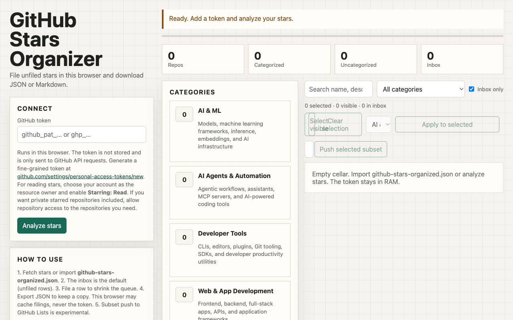

# GitHub Stars Organizer

Fetch your starred repositories in the browser, file the ones you have not sorted, and download JSON or Markdown. The token stays in the tab. Pushing a subset to a GitHub List is optional and may fail.



```bash
npm test
npm run start
```

Open [http://localhost:4173/](http://localhost:4173/). There is no `npm install`. Do not open the HTML file directly; the page needs a local server for ES modules.

Create a [fine-grained personal access token](https://github.com/settings/personal-access-tokens/new) for your own account with **Starring: Read**. Paste it into the page. It is sent only to `api.github.com` and is never written to this browser or to an export.

The desk opens on the unfiled inbox. Filing a row shrinks the queue. Manual moves survive a re-score. JSON is the reload file. Markdown is the list you can share.
